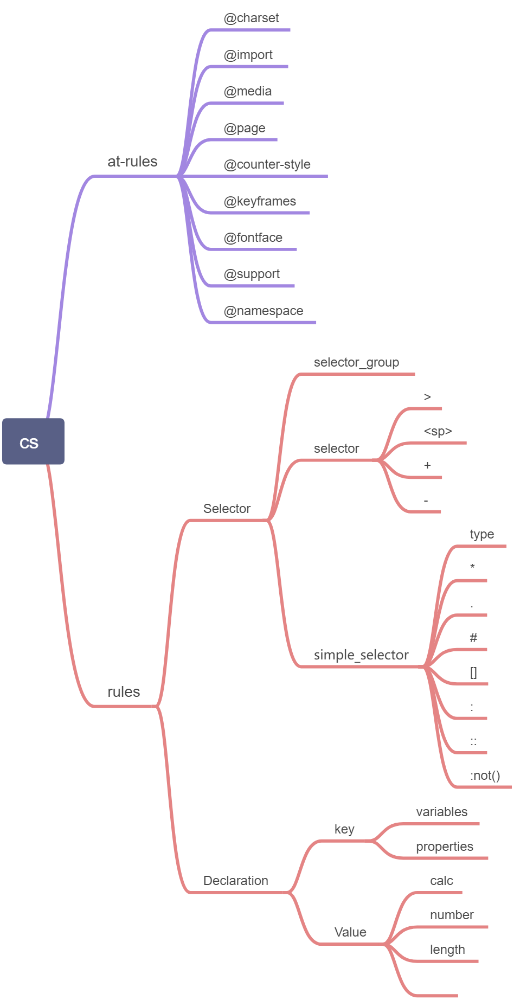

# 第六周重学CSS

## 一、CSS总论

### 1. CSS语法的研究 

- CSS2.1的语法 

  - https://www.w3.org/TR/CSS21/grammar.html#q25.0
  - https://www.w3.org/TR/css-syntax-3 

- CSS总体结构 

   

   - at-rules
      - @charset
      - @import
      - @media
      - @page
      - @counter-style
      - @keyframes
      - @fontface
      - @support
      - @namespace
   - rules

### 2. CSS @规则的研究 

- At-rules  

   - @charset ： https://www.w3.org/TR/css-syntax-3/  
   - @import ：https://www.w3.org/TR/css-cascade-4/  
   - @media ：https://www.w3.org/TR/css3-conditional/  
   - @page ： https://www.w3.org/TR/css-page-3/  
   - @counter-style ：https://www.w3.org/TR/css-counter-styles-3  
   - @keyframes ：https://www.w3.org/TR/css-animations-1/
   - @fontface ：https://www.w3.org/TR/css-fonts-3/  
   - @supports ：https://www.w3.org/TR/css3-conditional/  
   - @namespace ：https://www.w3.org/TR/css-namespaces-3/ 

### 3. CSS规则的结构 

- 选择器

- 声明

   - Key

   - Value

- Selector  

   - https://www.w3.org/TR/selectors-3/ 

   - https://www.w3.org/TR/selectors-4/  

-  Key  

   - Properties  

   - Variables: https://www.w3.org/TR/css-variables/  

- Value  

   - https://www.w3.org/TR/css-values-4/

## 二、选择器

- 简单选择器  
   - *  
   - div svg|a  
   - .cls  
   - #id  
   -  [attr=value]  
   -  :hover  
   - ::before
- 复合选择器 
- <简单选择器><简单选择器><简单选择器> 
- * 或者 div 必须写在最前面 
- 复杂选择器 
- <复合选择器><sp><复合选择器> 
- <复合选择器>">"<复合选择器> 
- <复合选择器>"~"<复合选择器> 
- <复合选择器>"+"<复合选择器> 
- <复合选择器>"||"<复合选择器>

### 练习：

>请写出下面选择器的优先级

```
div#a.b .c[id=x] 0 1 3 1 #a:not(#b) 0 2 0 0 *.a 0 0 1 0 div.a 0 0 1 1
A：div#a.b .c[id=x] 0 1 3 1 
B：#a:not(#b) 0 2 0 0 
C：*.a 0 0 1 0 
D：div.a 0 0 1 1
取 N = 100
A = 0 * N³+ 1 * N²+ 3 * N¹+ 1 
= 10301

同理可得

B = 20000
C=100
D = 101

所以优先级 B>A>D>C

```
## 三、伪类

- 链接/行为
   - :any-link  
   - :link :visited  
   - :hover  
   - :active  
   - :focus  
   - :target 

- 树结构
   - :empty  
   - :nth-child()  
   - :nth-last-child()  
   - :first-child :last-child :only-child 

- 逻辑型  
   - :not伪类  
   - :where :has 

## 四、伪元素  

- ::before  
- ::after  
- ::first-line  
- ::first-letter 


> 为什么first-letter可以设置float之类的，而first-line不行呢？

 first-letter 和 first-line 的计算时机不同，first-letter 匹配到的文本在 css compute 之前就可以确定，而 first-line 匹配到的文本需在渲染后才能确定。如果给 first-line 添加了可以改变盒模型、改变排版的属性，则应用了这些属性后，原本 first-line 匹配的文本就不一定完全匹配了，需要重新计算，这样就陷入了死循环。