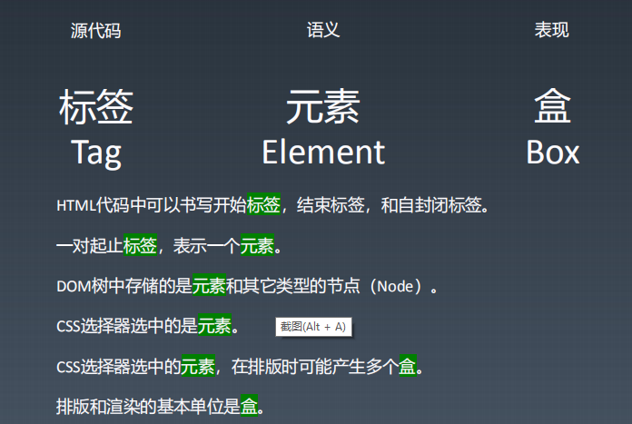
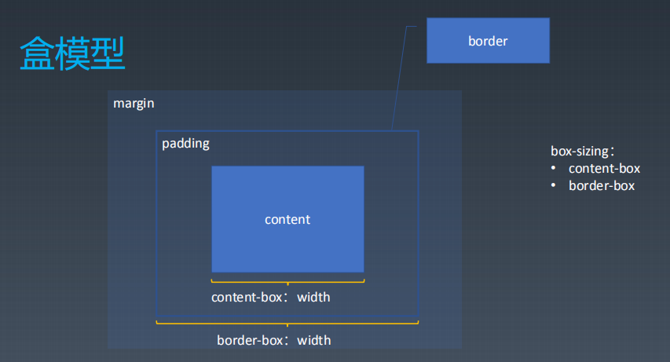
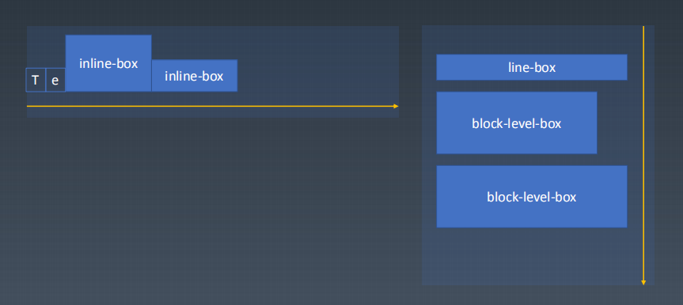
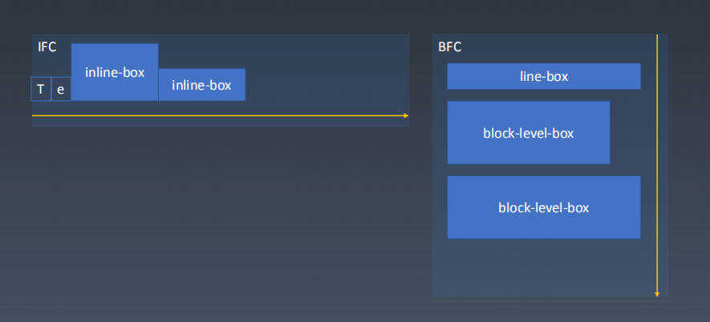
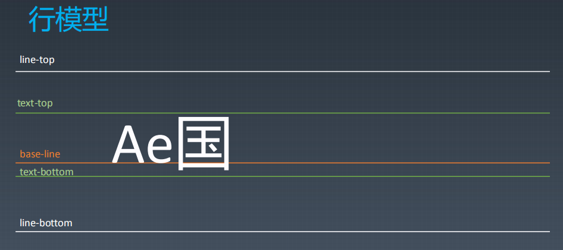
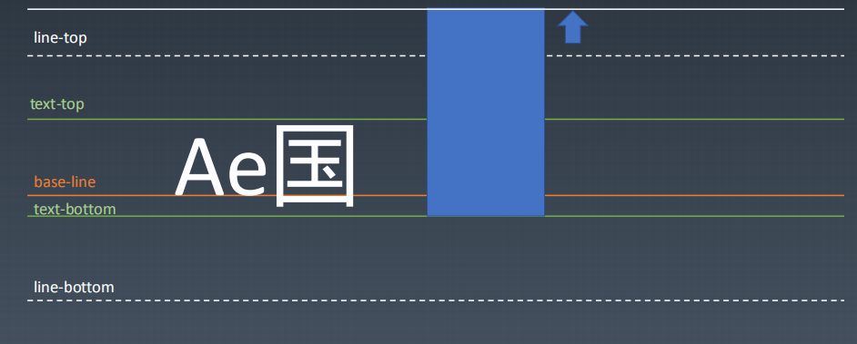
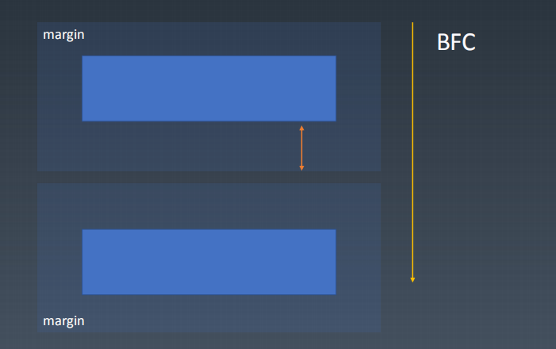
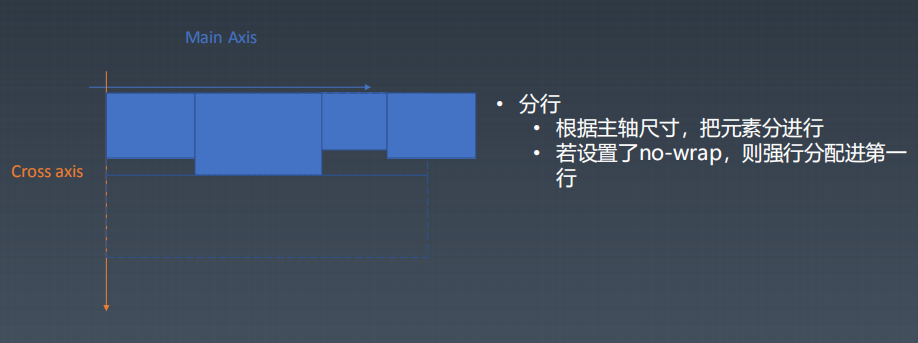
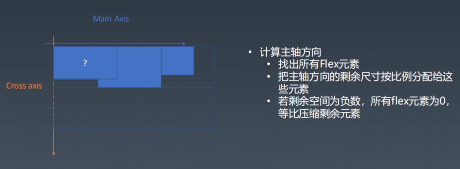
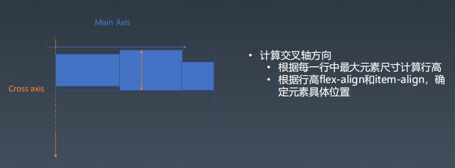

# 第7周重学CSS
## CSS排版
### 盒（Box）



### 正常流

#### 正常流排版 
> 依次排列，排不下了换行

在正常流基础上，我们有 float 相关规则，使得一些盒占据了正常流需要的空间，我们可以把 float 理解为“文字环绕”。


- 收集盒进行 
- 计算盒在行中的排布 
- 计算行的排布




#### 正常流的行级排布




#### 正常流的块级排布

float与clear

#### margin折叠


## Flex排版
> 布局的传统解决方案，基于盒状模型，依赖 display 属性 + position属性 + float属性。它对于那些特殊布局非常不方便，比如，垂直居中就不容易实现。
Flex 布局将成为未来布局的首选方案

- 收集盒进行
- 计算盒在主轴方向的排布
- 计算盒在交叉轴方向的排布





Flex 是 Flexible Box 的缩写，意为"弹性布局"，用来为盒状模型提供最大的灵活性。

任何一个容器都可以指定为 Flex 布局。

采用 Flex 布局的元素，称为 Flex 容器（flex container），简称"容器"。它的所有子元素自动成为容器成员，称为 Flex 项目（flex item），简称"项目"。

- 容器的属性
    - flex-direction
    - flex-wrap
    - flex-flow
    - justify-content
    - align-items
    - align-content

1. flex-direction属性
> flex-direction属性决定主轴的方向（即项目的排列方向）。
- row（默认值）：主轴为水平方向，起点在左端。
- row-reverse：主轴为水平方向，起点在右端。
- column：主轴为垂直方向，起点在上沿。
- column-reverse：主轴为垂直方向，起点在下沿。
```
.box {
  flex-direction: row | row-reverse | column | column-reverse;
}
```
2. flex-wrap属性
>默认情况下，项目都排在一条线（又称"轴线"）上。flex-wrap属性定义，如果一条轴线排不下，如何换行。
- nowrap（默认）：不换行。
- wrap：换行，第一行在上方。
- wrap-reverse：换行，第一行在下方。
```
.box{
  flex-wrap: nowrap | wrap | wrap-reverse;
}
```
3. justify-content属性
>justify-content属性定义了项目在主轴上的对齐方式。
- flex-start（默认值）：左对齐
- flex-end：右对齐
- center： 居中
- space-between：两端对齐，项目之间的间隔都相等。
- space-around：每个项目两侧的间隔相等。所以，项目之间的间隔比项目与边框的间隔大一倍。
```
.box {
  justify-content: flex-start | flex-end | center | space-between | space-around;
}
```
4. align-items属性
>align-items属性定义项目在交叉轴上如何对齐。
- flex-start：交叉轴的起点对齐。
- flex-end：交叉轴的终点对齐。
- center：交叉轴的中点对齐。
- baseline: 项目的第一行文字的基线对齐。
- stretch（默认值）：如果项目未设置高度或设为auto，将占满整个容器的高度。
```
.box {
  align-items: flex-start | flex-end | center | baseline | stretch;
}
```
5. align-content属性
>align-content属性定义了多根轴线的对齐方式。如果项目只有一根轴线，该属性不起作用。
- flex-start：与交叉轴的起点对齐。
- flex-end：与交叉轴的终点对齐。
- center：与交叉轴的中点对齐。
- space-between：与交叉轴两端对齐，轴线之间的间隔平均分布。
- space-around：每根轴线两侧的间隔都相等。所以，轴线之间的间隔比轴线与边框的间隔大一倍。
- stretch（默认值）：轴线占满整个交叉轴。
```
.box {
  align-content: flex-start | flex-end | center | space-between | space-around | stretch;
}
```
- 以下6个属性设置在项目上。
    - order
    - flex-grow
    - flex-shrink
    - flex-basis
    - flex
    - align-self

1. order属性
>order属性定义项目的排列顺序。数值越小，排列越靠前，默认为0。

```
.item {
  order: <integer>;
}
```
2. flex-grow属性
>flex-grow属性定义项目的放大比例，默认为0，即如果存在剩余空间，也不放大。
```
.item {
  flex-grow: <number>; /* default 0 */
}
```
3. flex-shrink属性
>flex-shrink属性定义了项目的缩小比例，默认为1，即如果空间不足，该项目将缩小。

```
.item {
  flex-shrink: <number>; /* default 1 */
}
```

4. flex-basis属性
>flex-basis属性定义了在分配多余空间之前，项目占据的主轴空间（main size）。浏览器根据这个属性，计算主轴是否有多余空间。它的默认值为auto，即项目的本来大小。

```
.item {
  flex-basis: <length> | auto; /* default auto */
}
```
5. flex属性
>flex属性是flex-grow, flex-shrink 和 flex-basis的简写，默认值为0 1 auto。后两个属性可选。

```
.item {
  flex: none | [ <'flex-grow'> <'flex-shrink'>? || <'flex-basis'> ]
}
```
6. align-self属性
>align-self属性允许单个项目有与其他项目不一样的对齐方式，可覆盖align-items属性。默认值为auto，表示继承父元素的align-items属性，如果没有父元素，则等同于stretch。

```
.item {
  align-self: auto | flex-start | flex-end | center | baseline | stretch;
}
```

## 动画与绘制

### Animation
- @keyframes定义
- animation: 使用
```
@keyframes mykf
{
    from {background: red;}
    to {background: yellow;}
}
div
{
    animation:mykf 5s infinite; 
}
```

- animation-name 时间曲线
- animation-duration 动画的时长；
- animation-timing-function 动画的时间曲线；
- animation-delay 动画开始前的延迟；
- animation-iteration-count 动画的播放次数；
- animation-direction 动画的方向。

```
@keyframes mykf {
0% { top: 0; transition:top ease}
50% { top: 30px;transition:top ease-in }
75% { top: 10px;transition:top ease-out }
100% { top: 0; transition:top linear}
}
```

### Transition

- transition-property 要变换的属性；
- transition-duration 变换的时长；
- transition-timing-function 时间曲线；
- transition-delay 延迟。

## 渲染与颜色

### HSL 颜色
当我们应用的每一种颜色都是 HSL 颜色时，就产生了一些非常有趣的效果，比如，我们可以通过变量来调整一个按钮的风格：
```
<style>
.button {
    display: inline-block;
    outline: none;
    cursor: pointer;
    text-align: center;
    text-decoration: none;
    font: 14px/100% Arial, Helvetica, sans-serif;
    padding: .5em 2em .55em;
    text-shadow: 0 1px 1px rgba(0,0,0,.3);
    border-radius: .5em;
    box-shadow: 0 1px 2px rgba(0,0,0,.2);
    color: white;
    border: solid 1px ;
}

</style>
<div class="button orange">123</div>

```
```

var btn = document.querySelector(".button");
var h = 25;
setInterval(function(){
  h ++;
  h = h % 360;
  btn.style.borderColor=`hsl(${h}, 95%, 45%)`
  btn.style.background=`linear-gradient(to bottom,  hsl(${h},95%,54.1%),  hsl(${h},95%,84.1%))`
},100);
```
### 渐变
在 CSS 中，background-image这样的属性，可以设为渐变。
CSS 中支持两种渐变，一种是线性渐变，一种是放射性渐变
```
linear-gradient(direction, color-stop1, color-stop2, ...);
```
这里的 direction 可以是方向，也可以是具体的角度。
例如：
- to bottom
- to top
- to leftto right
- to bottom left
- to bottom right
- to top left
- to top right
- 120deg
- 3.14rad

以上这些都是合理的方向取值。
color-stop 是一个颜色和一个区段，
例如：
- rgba(255,0,0,0)
- orange
- yellow 10%
- green 20%
- lime 28px

### 形状
CSS 中的很多属性还会产生形状，
比如我们常见的属性：
- border
- box-shadow
- border-radius