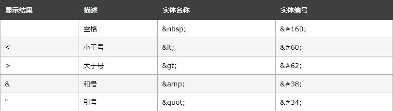

# 第8周重学HTML 浏览器API

## 一、HTML语言的追根溯源
>HTML 称为“标记语言（mark up language）”，它是纯文本的一种升级，“标记”一词的概念来自：编辑审稿时使用不同颜色笔所做的“标记”。
----
>在上世纪 80 年代，“富文本”的概念在计算机领域的热门，犹如如今的“AI”和“区块链”，而 Tim Berners-Lee 当时去设计 HTML，也并非是凭空造出来，他使用了当时已有的一种语言：SGML。

----
>SGML 是一种古老的标记语言，可以追溯到 1969 年 IBM 公司所使用的技术，SGML 十分复杂，严格来说，HTML 是 SGML 中规定的一种格式，但是实际的浏览器没有任何一个是通过 SGML 引擎来解析 HTML 的。

### DTD
DTD 的全称是 Document Type Defination，也就是文档类型定义。SGML 用 DTD 来定义每一种文档类型，HTML 属于 SGML，在 HTML5 出现之前，HTML 都是使用符合 SGML 规定的 DTD。
如果你是一个上个时代走过来的前端，一定还记得 HTML4.01 有三种 DTD。分别是
- 严格模式
- 过渡模式
- frameset 模式。
#### 严格模式
```
<!DOCTYPE HTML PUBLIC "-//W3C//DTD HTML 4.01//EN" "http://www.w3.org/TR/html4/strict.dtd">
```

#### 过渡模式
```
<!DOCTYPE HTML PUBLIC "-//W3C//DTD HTML 4.01 Transitional//EN" "http://www.w3.org/TR/html4/loose.dtd">
```

#### frameset 模式
```
<!DOCTYPE HTML PUBLIC "-//W3C//DTD HTML 4.01 Frameset//EN" "http://www.w3.org/TR/html4/frameset.dtd">
```

### 文本实体

>HTML 中的预留字符必须被替换为字符实体。

在 HTML 中，某些字符是预留的。

在 HTML 中不能使用小于号（<）和大于号（>），这是因为浏览器会误认为它们是标签。

如果希望正确地显示预留字符，我们必须在 HTML 源代码中使用字符实体（character entities）。

字符实体类似这样：
```
&entity_name;

或者

&#entity_number;
```
>如需显示小于号，我们必须这样写：&lt; 或 &#60;



**提示：使用实体名而不是数字的好处是，名称易于记忆。不过坏处是，浏览器也许并不支持所有实体名称（对实体数字的支持却很好）。**

## 二 、语义类标签运用
>语义类标签也是大家工作中经常会用到的一类标签，它们的特点是视觉表现上互相都差不多，主要的区别在于它们表示了不同的语义，比如大家会经常见到的 section、nav、p，这些都是语义类的标签。

**正确地使用语义标签可以带来很多好处。语义类标签对开发者更为友好，使用语义类标签增强了可读性**
- 语义类标签对开发者更为友好，使用语义类标签增强了可读性，即便是在没有 CSS 的时候，开发者也能够清晰地看出网页的结构，也更为便于团队的开发和维护。
- 除了对人类友好之外，语义类标签也十分适宜机器阅读。它的文字表现力丰富，更适合搜索引擎检索（SEO），也可以让搜索引擎爬虫更好地获取到更多有效信息，有效提升网页的搜索量，并且语义类还可以支持读屏软件，根据文章可以自动生成目录等等。

如下标签就是语义性特别强的标签，如果我们正确的使用他们，可以大大增强代码的可读性

- aside
> &lt;aside> 的内容可用作文章的侧栏。
- article
> &lt;article> 标签规定独立的自包含内容。
- hgroup, h1, h2
>hgroup 是标题组，h1 是一级标题，h2 是二级标题
- abbr
>abbr 标签表示缩写。
- hr
>hr 标签表示横向分隔线,表示故事走向的转变或者话题的转变
- P
><p> 标签定义段落。
- strong
>把文本定义为语气更强的强调的内容
- blockquote, q, cite
>在 HTML 中，有三个跟引述相关的标签 blockquote 表示段落级引述内容，q 表示行内的引述内容，cite 表示引述的作品名。
- time
>该元素能够以机器可读的方式对日期和时间进行编码，这样，举例说，用户代理能够把生日提醒或排定的事件添加到用户日程表中，搜索引擎也能够生成更智能的搜索结果。
- figure, figcaption
>用作文档中插图的图像，带有一个标题
- dfn
>dfn 标签是用来包裹被定义的名词。
- nav, ol, ul
>&lt;nav> 标签定义导航链接的部分。<br>
ol 和 ul 的区分是内容是否有顺序关系，每一项的前面不论是数字还是点，都不会影响语义的判断。所以，你可以注意一下这里，不要因为视觉表现效果，而改变语义的使用。
- pre, samp, code
>pre 元素可定义预格式化的文本。被包围在 pre 元素中的文本通常会保留空格和换行符。而文本也会呈现为等宽字体。
&lt;pre> 标签的一个常见应用就是用来表示计算机的源代码。
samp定义样本文本。<br>
code定义计算机代码文本。<br>


## 三、HTML 语法

