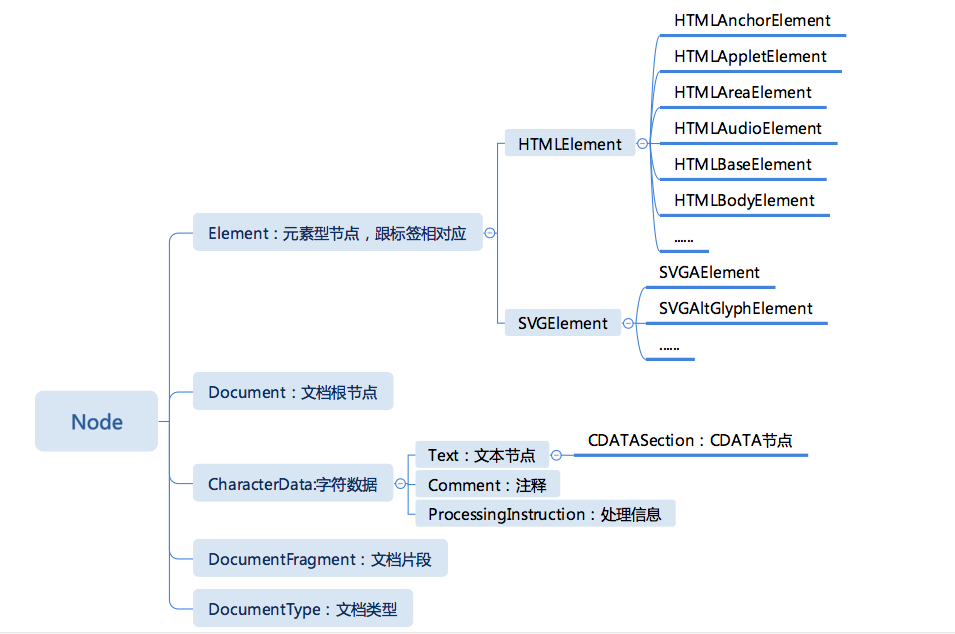

# 第8周 重学浏览器API

 ## 浏览器DOM
DOM API 大致会包含 4 个部分。
- 节点：DOM 树形结构中的节点相关 API。
- 事件：触发和监听事件相关 API。
- Range：操作文字范围相关 API。
- 遍历：遍历 DOM 需要的 API
### 节点
DOM 的树形结构所有的节点有统一的接口 Node


### Node
Node 是 DOM 树继承关系的根节点，它定义了 DOM 节点在 DOM 树上的操作，首先，Node 提供了一组属性，来表示它在 DOM 树中的关系，它们是：
- parentNode
- childNodes
- firstChild
- lastChild
- nextSibling
- previousSibling
Node 中也提供了操作 DOM 树的 API，主要有下面几种。
- appendChild
- insertBefore
- removeChild
- replaceChild

Node 还提供了一些高级 API
- compareDocumentPosition 是一个用于比较两个节点中关系的函数。
- contains 检查一个节点是否包含另一个节点的函数。
- isEqualNode 检查两个节点是否完全相同。
- isSameNode 检查两个节点是否是同一个节点，实际上在 JavaScript 中可以用“===”。
- cloneNode 复制一个节点，如果传入参数 true，则会连同子元素做深拷贝。

DOM 标准规定了节点必须从文档的 create 方法创建出来，不能够使用原生的 JavaScript 的 new 运算。于是 document 对象有这些方法。
- createElement
- createTextNode
- createCDATASection
- createComment
- createProcessingInstruction
- createDocumentFragment
- createDocumentType

查找元素document 节点提供了查找元素的能力。比如有下面的几种。
- querySelector
- querySelectorAll
- getElementById
- getElementsByName
- getElementsByTagName
- getElementsByClassName
 ## 浏览器CSSOM

 ## 浏览器事件
 ### 事件概述
一般来说，事件来自输入设备，我们平时的个人设备上，输入设备有三种：
- 键盘；
- 鼠标；
- 触摸屏。

### 捕获与冒泡
捕获是计算机处理事件的逻辑，而冒泡是人类处理事件的逻辑。
**在一个事件发生时，捕获过程跟冒泡过程总是先后发生，跟你是否监听毫无关联。**
addEventListener 有三个参数：
- 事件名称；
- 事件处理函数；
- 捕获还是冒泡。

事件处理函数不一定是函数，也可以是个 JavaScript 具有 handleEvent 方法的对象，看下例子：
```

var o = {
  handleEvent: event => console.log(event)
}
document.body.addEventListener("keydown", o, false);
```
**第三个参数不一定是 bool 值，也可以是个对象，它提供了更多选项。once：只执行一次。passive：承诺此事件监听不会调用 preventDefault，这有助于性能。useCapture：是否捕获（否则冒泡）。**

实际使用，在现代浏览器中，还可以不传第三个参数，我建议默认不传第三个参数，因为我认为冒泡是符合正常的人类心智模型的，大部分业务开发者不需要关心捕获过程。除非你是组件或者库的使用者，那就总是需要关心冒泡和捕获了。

## 焦点
>键盘事件是由焦点系统控制的，一般来说，操作系统也会提供一套焦点系统，但是现代浏览器一般都选择在自己的系统内覆盖原本的焦点系统。

浏览器 API 还提供了 API 来操作焦点，如：
```

document.body.focus();

document.body.blur();
```
